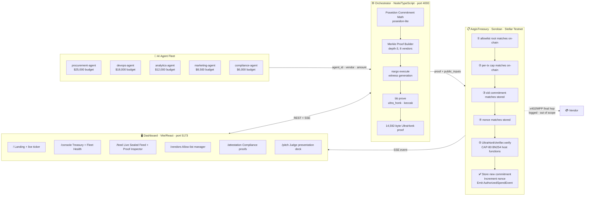
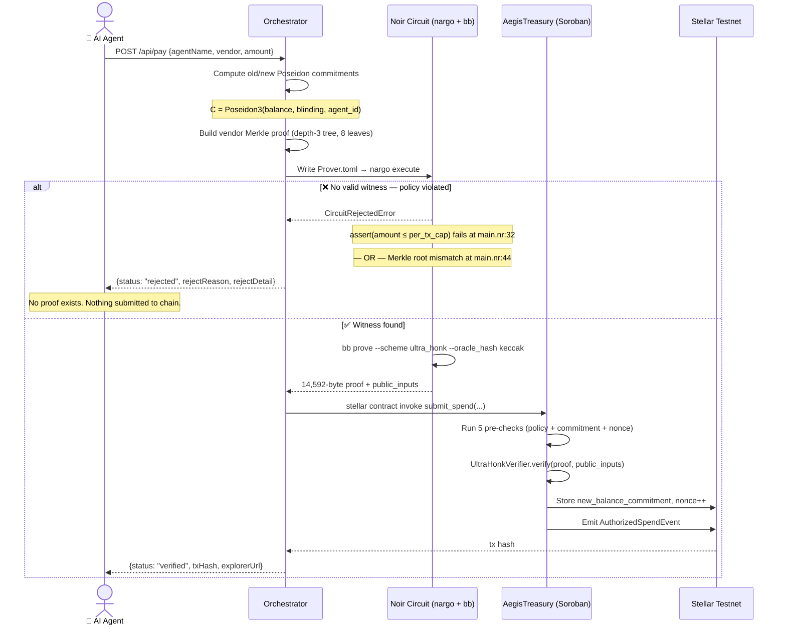

<div align="center">


# AEGIS — Confidential ZK Payment Rails for AI Agents

**Built for Stellar Hacks: Real-World ZK · DoraHacks 2026**

*Your agents pay in the open. What they spent, and why it was allowed, stays between you and the proof.*

[](https://aegis-delta-gules.vercel.app)
[](https://stellar.expert/explorer/testnet/contract/CDPFNNPOXFZLFZOJRUN6PW7LYWOIU6SLFBJZKP3BUC6YMOUIL6XB6MF6)
[](#-test-results)

</div>

---

## 🏆 Hackathon Submission

| Field | Details |
|---|---|
| **Event** | Stellar Hacks: Real-World ZK — DoraHacks |
| **Track** | Zero-Knowledge / AI Agent Payments |
| **Build Window** | ~3 days (June 2026) |
| **Status** | ✅ MVP + both stretch goals delivered |
| **Live Demo** | [aegis-delta-gules.vercel.app](https://aegis-delta-gules.vercel.app) |

---

## 🔥 The Problem

Stellar's **x402** and **MPP** protocols let AI agents autonomously pay for APIs, data, and compute. That's real, live infrastructure.

**But Stellar is a public ledger.**

> A company running a fleet of 10 AI agents — procurement, DevOps, analytics — is broadcasting every vendor relationship, budget allocation, and spending pattern to anyone watching the chain. That's a real competitive-intelligence leak, not a theoretical risk.

And the controls meant to stop agents from overspending? They're values in a contract that anyone can read — but **no one can prove** wasn't tampered with, without access to the full history.

---

## ✨ The Solution — Aegis

**One ZK circuit closes both gaps.**

| Feature | What it does |
|---|---|
| 🔒 **Shielded Balances** | Each agent's balance is a Poseidon commitment — the number never touches the chain |
| ⚡ **ZK Policy Enforcement** | A real Noir/UltraHonk proof must satisfy 5 circuit constraints before the contract accepts a payment |
| 🚫 **Cryptographic Rejection** | A non-compliant payment has no valid proof — the math can't be satisfied. No `if` statement catches it |
| 📋 **Compliance Attestation** | Prove "spend stayed under $X in 24h" to an auditor — without revealing a single transaction |
| 🔄 **Real-Time Feed** | Payments stream sealed (`●●●●●●`), reveal outcome with a real stellar.expert tx link |

---

## 🌟 Uniqueness

> **Why is Aegis different from every other "private payment" project?**

### 1. Policy enforcement is in the circuit, not the application
Every other payment privacy system enforces rules in application code — an `if` statement that could be bypassed. In Aegis, the circuit's `assert` statements **are** the enforcement. A payment that violates the cap or the vendor allow-list **cannot generate a proof**. There's nothing to bypass.

### 2. First use of Stellar Protocol 26 (CAP-80) for agent payment gating
CAP-80's BN254 host functions reached Testnet just weeks before this build. Aegis is among the first applications to use these primitives to gate a real payment — not just a research demo of proof verification.

### 3. Both ZK circuits are purpose-built, not generic
- `spend_proof` — proves per-payment policy compliance (cap, Merkle allow-list, balance, nonce)
- `compliance_attestation` — proves aggregate spend facts over a time window using the "bookend commitment" approach — two snapshots, no per-transaction replay

### 4. Zero mocks anywhere in the stack
Real `nargo` + `bb` proving. Real Soroban contract on Testnet. Real 14,592-byte UltraHonk proofs. Real stellar.expert transaction hashes. The self-test cross-verifies off-chain Poseidon math bit-for-bit against the real circuit output. **No placeholder bytes. No simulated transactions.**

### 5. Replay-attack protection tested end-to-end with a real proof
The integration test submits a real 14KB UltraHonk proof, asserts it settles, then replays the identical proof and asserts `StaleCommitment`. This is tested against a real cryptographic proof — not a dummy.

---

## 🛠️ Tech Stack

### Zero-Knowledge Layer
| Tool | Version | Role |
|---|---|---|
| **Noir** | 1.0.0-beta.9 | ZK circuit language for both circuits |
| **Barretenberg (`bb`)** | v0.87.0 | UltraHonk prover (`--scheme ultra_honk --oracle_hash keccak`) |
| **Poseidon (BN254)** | `poseidon_src/` vendored | Hash function for commitments and Merkle tree |
| `poseidon-lite` | ^0.3.0 | Off-chain Poseidon math (verified bit-identical to circuit) |

### Smart Contract
| Tool | Version | Role |
|---|---|---|
| **Rust** | stable | Soroban contract language |
| **Soroban SDK** | latest | Stellar smart contract framework |
| **rs-soroban-ultrahonk** | vendored (MIT) | UltraHonk verifier using CAP-80 BN254 host functions |
| **Stellar Protocol 26 (CAP-80)** | Testnet | BN254 pairing host functions for cheap on-chain ZK verification |
| **Stellar CLI** | v27.0.0 | Contract deployment and invocation |

### Orchestrator (Off-chain Prover Service)
| Tool | Version | Role |
|---|---|---|
| **Node.js / TypeScript** | ESM, `tsx` | Runtime |
| **Express** | v5 | REST + SSE API server |
| **WSL (Ubuntu)** | — | Bridge to Noir/Barretenberg/Stellar CLI toolchain |

### Dashboard (Frontend)
| Tool | Version | Role |
|---|---|---|
| **Vite** | v8 | Build tool |
| **React** | v19 | UI framework |
| **React Router** | v7 | Client-side routing (5 screens + pitch deck) |
| **Chart.js** | latest | Fleet health outcome chart (code-split) |
| **`@paper-design/shaders-react`** | ^0.0.76 | WebGL animated hero orb (PulsingBorder shader) |
| **Playwright** | ^1.61 | E2E smoke test suite |
| **Vercel** | — | Public deployment |

---

## 📜 Deployed Contracts

| Network | Contract ID | Explorer |
|---|---|---|
| **Stellar Testnet** | `CDPFNNPOXFZLFZOJRUN6PW7LYWOIU6SLFBJZKP3BUC6YMOUIL6XB6MF6` | [View on stellar.expert ↗](https://stellar.expert/explorer/testnet/contract/CDPFNNPOXFZLFZOJRUN6PW7LYWOIU6SLFBJZKP3BUC6YMOUIL6XB6MF6) |

> **Note:** The orchestrator deploys a **fresh** `AegisTreasury` instance every time it starts. The address above is from the most recent verified run. Every transaction in the dashboard links to stellar.expert for independent verification.

### Live Stats (as of latest run)

| Metric | Value |
|---|---|
| Total proof runs | **80** |
| Payments settled on-chain | **45** |
| Payments blocked by circuit | **35** |
| Violations that reached settlement | **0** (cryptographically guaranteed) |

---

## 🏗️ Architecture



---

## 🔄 Payment Flow (per transaction)



---

## 🔐 Circuit Design

### `spend_proof` — Per-Payment Compliance (`aegis-circuit/src/main.nr`)

**Public inputs** (bound to the proof — any change invalidates it):
`old_balance_commitment` · `new_balance_commitment` · `per_tx_cap` · `vendor_allowlist_root` · `agent_id` · `agent_nonce`

**Private inputs** (never leave the prover):
`old_balance` · `blinding_old` · `amount` · `new_balance` · `blinding_new` · `vendor_leaf` · `merkle_path[3]` · `merkle_indices[3]`

**5 constraints enforced:**

```
① Poseidon3(old_balance, blinding_old, agent_id) == old_balance_commitment
② old_balance >= amount  (no overspend)
③ new_balance == old_balance - amount  (honest accounting)
④ amount <= per_tx_cap  (treasury policy cap)
⑤ Poseidon Merkle path proves vendor_leaf ∈ vendor_allowlist_root  (allow-list)
```

### `compliance_attestation` — Aggregate Disclosure (`aegis-attestation-circuit/src/main.nr`)

Given two real commitment snapshots (period start + current), proves cumulative spend is bounded — **without replaying any individual transaction**.

```
① Poseidon3(starting_balance, blinding_start, agent_id) == starting_commitment
② Poseidon3(ending_balance, blinding_end, agent_id) == ending_commitment
③ ending_balance <= starting_balance  (balance only decreases via verified spends)
④ starting_balance - ending_balance <= max_spend  (the attestation claim)
```

---

## 📊 What's Real vs. Out of Scope

### ✅ Verified Real

| Claim | Evidence |
|---|---|
| Real 14,592-byte UltraHonk proofs | `nargo` 1.0.0-beta.9 + `bb` v0.87.0, real `Prover.toml` input files |
| Real on-chain verification | Protocol 26 CAP-80 BN254 host functions, rs-soroban-ultrahonk |
| Real circuit-level rejections | `nargo execute` fails to find witness — no JS `if` check involved |
| Real Merkle tree | Depth-3 Poseidon tree rebuilt on every vendor change, root stored on-chain |
| Real Poseidon parity | `poseidon-lite` cross-verified bit-for-bit against circuit output (14/14 selftest) |
| Real replay protection | Integration test submits real proof, asserts success, replays, asserts `StaleCommitment` |
| Real stellar.expert links | Every tx hash links to verifiable Testnet transaction |
| Zero plaintext amounts | `●●●●●●` everywhere — including chart tooltips, threat demo banners, and toasts |

### 🚧 Explicitly Out of Scope

| Item | Why it's a boundary, not a shortcut |
|---|---|
| Live x402/MPP settlement | The final hop to a vendor's real address must be public by construction — like a Tornado Cash withdrawal. Aegis hides *which* agent funded it, not the existence of a payment rail. **Logged, not executed.** |
| CAP-79 muxed sub-accounts | Agent ID is a plain `u64`, not a muxed `M...` Stellar sub-address. |

---

## 🧪 Test Results

| Suite | Command | Passing |
|---|---|---|
| `spend_proof` circuit | `cd aegis-circuit && nargo test` | ✅ **3 / 3** |
| `compliance_attestation` circuit | `cd aegis-attestation-circuit && nargo test` | ✅ **3 / 3** |
| `AegisTreasury` Soroban contract | `cd aegis-contract && cargo test` | ✅ **18 / 18** |
| Orchestrator Poseidon self-test | `cd orchestrator && npm run selftest` | ✅ **14 / 14** |
| Dashboard Playwright e2e | `cd dashboard && npm run test:e2e` | ✅ **12 / 12** |
| **Total** | | ✅ **50 / 50** |

> The **18 contract tests** include 15 unit tests (all pre-verification error paths + admin auth) and **3 integration tests** that load a real 14KB UltraHonk proof from fixtures, verify it on-chain in-process, then replay the same proof and assert it's rejected — proving replay-attack protection against a real cryptographic proof, not a dummy.

---

## 🖥️ Dashboard Screens

| Route | Screen | What it shows |
|---|---|---|
| `/` | **Landing** | Hero orb, live stat counters, real-time activity ticker |
| `/console` | **Treasury Console** | 5-agent roster, Fleet Health tab, per-agent detail drawer |
| `/feed` | **Live Sealed Feed** | Real-time SSE payment stream, sealed amounts, Proof Inspector |
| `/vendors` | **Vendor Allow-list** | 8-vendor Merkle tree manager, live root display, toggle switches |
| `/attestation` | **Compliance Attestation** | 24h / 7d / session proofs, staged loading state, shareable result card |
| `/pitch` | **Judge Pitch Deck** | 10-slide in-app deck with CSS architecture/flow diagrams and live stats |

---

## 🗂️ Repository Layout

```
aegis/
├── aegis-circuit/                  # Noir: spend_proof (per-payment ZK proof)
│   ├── src/main.nr                 #   5 constraints: commitment·balance·cap·Merkle·nonce
│   └── Nargo.toml
│
├── aegis-attestation-circuit/      # Noir: compliance_attestation (aggregate disclosure)
│   ├── src/main.nr                 #   bookend commitment approach, no tx replay needed
│   └── Nargo.toml
│
├── aegis-contract/                 # Rust/Soroban: AegisTreasury on-chain verifier
│   ├── src/lib.rs                  #   submit_spend · verify_attestation · policy mgmt
│   ├── src/test.rs                 #   15 unit tests
│   ├── tests/real_proof.rs         #   real 14KB proof integration test + replay test
│   └── tests/real_attestation_proof.rs
│
├── rs-soroban-ultrahonk/           # Vendored: UltraHonk verifier for Soroban (MIT)
├── poseidon_src/                   # Vendored: Poseidon hash Noir library
│
├── orchestrator/src/
│   ├── server.ts                   # Express API (all endpoints)
│   ├── treasury.ts                 # Agent state · payments · attestation logic
│   ├── prover.ts                   # nargo execute + bb prove via WSL
│   ├── chain.ts                    # stellar contract invoke via WSL
│   ├── poseidon.ts                 # Off-chain Poseidon math (circuit-verified)
│   ├── roster.ts                   # 5 agents + 8 vendors (single source of truth)
│   ├── seed.ts                     # Register roster on-chain
│   ├── demo-run.ts                 # 12-payment scripted scenario
│   └── selftest.ts                 # 14-check Poseidon cross-verification
│
├── dashboard/src/
│   ├── LandingPage.tsx             # Hero orb · stat row · activity ticker
│   ├── TreasuryConsole.tsx         # Agent roster · Fleet Health tab
│   ├── LiveSealedFeed.tsx          # SSE stream · Proof Inspector
│   ├── VendorsScreen.tsx           # Allow-list · Merkle root · toggles
│   ├── AttestationScreen.tsx       # Compliance proofs + result card
│   └── PitchDeck.tsx               # 10-slide judge presentation
│
├── docs/shadow.md                  # Original hackathon PRD ("Umbra")
├── DEMO_SCRIPT.md                  # Full video narration script
└── PROJECT_REPORT.md               # End-to-end audit report (A–Z)
```

---

## 🚀 Running Locally

> **Requires WSL (Ubuntu)** — Noir/Barretenberg/Stellar CLI don't ship native Windows binaries. The orchestrator calls `wsl.exe` automatically.

### Step 1 — WSL Toolchain (one-time setup)

```bash
# Noir — pinned to 1.0.0-beta.9
curl -L https://raw.githubusercontent.com/noir-lang/noirup/main/install | bash
~/.nargo/bin/noirup -v 1.0.0-beta.9

# Barretenberg — pinned to v0.87.0 (newer versions are incompatible)
mkdir -p ~/.bb087/bin
curl -L https://github.com/AztecProtocol/aztec-packages/releases/download/v0.87.0/barretenberg-amd64-linux.tar.gz -o /tmp/bb.tar.gz
tar -xzf /tmp/bb.tar.gz -C ~/.bb087/bin

# Stellar CLI v27.0.0
mkdir -p ~/.local/bin
curl -L https://github.com/stellar/stellar-cli/releases/download/v27.0.0/stellar-cli-27.0.0-x86_64-unknown-linux-gnu.tar.gz -o /tmp/stellar.tar.gz
tar -xzf /tmp/stellar.tar.gz -C ~/.local/bin
curl -sL https://github.com/jqlang/jq/releases/latest/download/jq-linux-amd64 -o ~/.local/bin/jq
chmod +x ~/.local/bin/jq ~/.local/bin/stellar

# Rust wasm target for the Soroban contract
rustup target add wasm32v1-none
```

### Step 2 — Terminal 1: Orchestrator

```bash
cd orchestrator && npm install
npm run start      # http://localhost:4000 — deploys fresh contract (~1-3 min)
```

> ⚠️ Use `npm run start`, **not** `npm run dev` (dev mode redeploys on every file save)

### Step 3 — Terminal 2: Seed & Demo

```bash
cd orchestrator
npm run seed       # registers 5 agents + 8 vendors on-chain (real transactions)
npm run demo       # plays 12-payment scenario (real proofs + real Testnet txs)
npm run selftest   # 14-check Poseidon/Merkle cross-verification
```

### Step 4 — Terminal 3: Dashboard

```bash
cd dashboard && npm install
npm run dev        # http://localhost:5173
npm run test:e2e   # Playwright smoke test (needs both servers running)
```

### Optional — Circuit & Contract Tests

```bash
cd aegis-circuit             && nargo test    # 3/3
cd aegis-attestation-circuit && nargo test    # 3/3
cd aegis-contract            && cargo test    # 18/18
```

---

## 💡 Why Stellar Protocol 26

**CAP-80** (Protocol 26 "Yardstick") added BN254 elliptic curve host functions to Soroban. These make on-chain UltraHonk proof verification — which requires pairing checks — cheap enough to gate a real payment.

Without CAP-80, verifying a 14KB pairing-based proof on Stellar would have been prohibitively expensive. This infrastructure shipped to Testnet just **weeks before this build**. Aegis is among the first projects to use it for agent payment enforcement rather than generic private transfers.

---

## 🗺️ What We'd Build Next

| Item | Priority |
|---|---|
| Live x402/MPP facilitator for the final settlement hop | High |
| CAP-79 muxed sub-accounts for per-agent Stellar addresses | High |
| Per-agent transaction caps (small circuit extension) | Medium |
| Containerize orchestrator with WSL toolchain for public hosting | Medium |
| Parallel proof generation — remove the per-circuit FIFO queue bottleneck | Medium |
| Fuller e2e Playwright suite covering real proof generation end-to-end | Low |

---

## 🙏 Credits & Acknowledgements

| Dependency | Role |
|---|---|
| [`rs-soroban-ultrahonk`](https://github.com/yugocabrio/rs-soroban-ultrahonk) | MIT-licensed UltraHonk verifier for Soroban — vendored, not written from scratch |
| Noir Poseidon library | BN254 Poseidon hash — vendored under `poseidon_src/` |
| Stellar / Soroban team | Protocol 26 CAP-80 BN254 host functions that made this possible |
| Aztec / Noir team | Noir language + Barretenberg UltraHonk prover |

---

<div align="center">

### Built in ~3 days for Stellar Hacks: Real-World ZK

**Real proofs. Real transactions. Zero plaintext amounts. Ever.**

[](https://noir-lang.org)
[](https://github.com/AztecProtocol/aztec-packages)
[](https://stellar.org)
[](https://aegis-delta-gules.vercel.app)

</div>
