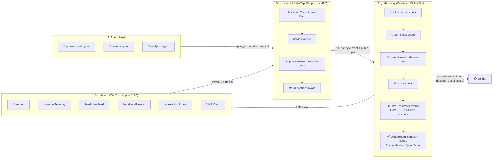
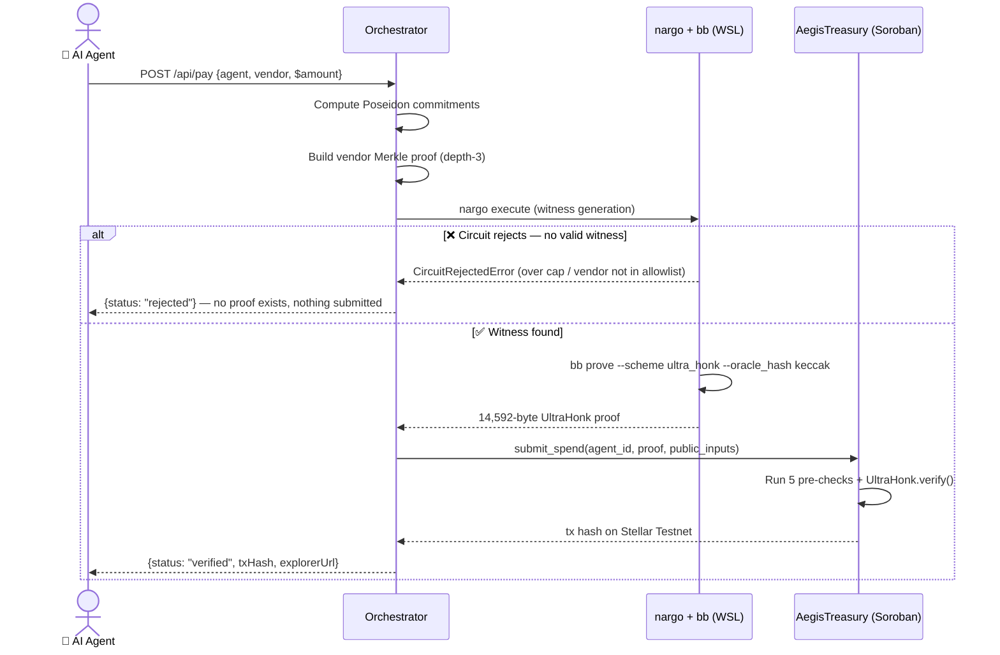

<div align="center">

# ⚡ Aegis

### Zero-knowledge spend compliance for AI agent payments on Stellar

*Your agents pay in the open. What they spent, and why it was allowed, stays between you and the proof.*

[](https://noir-lang.org)
[](https://github.com/AztecProtocol/aztec-packages)
[](https://stellar.org)
[](https://github.com/Lakshmikanth-3/aegis)

**[🌐 Live Demo](https://aegis-delta-gules.vercel.app)** · **[🔍 Testnet Contract](https://stellar.expert/explorer/testnet/contract/CDPFNNPOXFZLFZOJRUN6PW7LYWOIU6SLFBJZKP3BUC6YMOUIL6XB6MF6)**

</div>

---

## 🔥 The Problem

Stellar's **x402** and **MPP** protocols let AI agents pay for APIs, data, and compute autonomously — no human approving each transaction. **That's live infrastructure.**

But **Stellar is a public ledger**. Every agent payment — who it paid, how much, how often — is visible to anyone.

| Problem | Impact |
|---|---|
| Public spend graph | Competitors reconstruct your vendor relationships and budget allocation for free |
| Inspectable policy contracts | Anyone can see your spending controls; nobody can *prove* they weren't tampered with |
| No agent privacy | A fleet of 10 agents produces 10× the competitive intelligence leak |

## ✅ The Solution

**Aegis closes both gaps with one ZK circuit.**

```
❌ Before Aegis          ✅ With Aegis
──────────────────       ──────────────────────────────────────────
Agent pays $340          Agent proves it can pay $340 without
to AWS → public          revealing the amount, who it paid,
ledger shows all         or its remaining balance.
                         Only the proof goes on-chain.
```

- Each agent draws from a **shielded balance commitment** — not a visible running balance
- Every payment is gated by a **real Noir/UltraHonk ZK proof** verifying policy compliance
- A **compliance attestation** proves aggregate spend facts to auditors — zero individual transactions revealed
- **Non-compliant payments have no valid proof** — the math can't be satisfied, so there's nothing to submit

---

## 🏗️ Architecture



---

## 🔄 Payment Workflow



---

## 📊 What's Real vs. Out of Scope

### ✅ Real (verified, not mocked)

| What | Detail |
|---|---|
| **ZK Proofs** | Real `nargo` 1.0.0-beta.9 + `bb` v0.87.0 · 14,592-byte UltraHonk proofs · 1,760-byte VKs |
| **On-chain Verification** | `rs-soroban-ultrahonk` + Protocol 26 CAP-80 BN254 host functions on Stellar Testnet |
| **Payment Rejections** | Every rejection is a genuine `nargo execute` constraint failure — no JS-side `if` checks |
| **Vendor Allow-list** | Depth-3 Poseidon Merkle tree — adding/removing rebuilds the tree and calls `update_policy` on-chain |
| **Poseidon Parity** | Off-chain `poseidon-lite` cross-verified bit-for-bit against the real circuit output (14/14 selftest) |
| **Transaction Hashes** | Every hash links to a real Stellar Testnet tx on stellar.expert |
| **Replay Protection** | A captured real proof resubmitted gets `StaleCommitment` — tested with a real 14KB proof |
| **Amount Privacy** | Dashboard **never** renders a plaintext amount — sealed as `●●●●●●` everywhere |

### 🚧 Explicitly Out of Scope

| Item | Reason |
|---|---|
| **Live x402/MPP settlement** | The final hop to a vendor's real address must be public by construction (like a Tornado Cash withdrawal). Aegis hides *which* agent funded a payment — not the existence of a payment rail. Logged, not executed. |
| **CAP-79 muxed sub-accounts** | Agent identity is a plain `u64` — not a muxed `M...` Stellar address. |

---

## 🧪 Test Results

| Suite | Command | Result |
|---|---|---|
| `spend_proof` circuit | `cd aegis-circuit && nargo test` | ✅ **3/3 passing** |
| `compliance_attestation` circuit | `cd aegis-attestation-circuit && nargo test` | ✅ **3/3 passing** |
| `AegisTreasury` contract | `cd aegis-contract && cargo test` | ✅ **18/18 passing** |
| Orchestrator Poseidon self-test | `cd orchestrator && npm run selftest` | ✅ **14/14 passing** |
| Dashboard Playwright e2e | `cd dashboard && npm run test:e2e` | ✅ **12/12 passing** |

> The contract's **18 tests** include 15 unit tests (all pre-verification error paths) and **3 integration tests that load a real 14KB UltraHonk proof**, verify it on-chain, then replay the same proof and assert it's rejected — proving replay-attack protection against a real proof.

---

## 🗂️ Repository Layout

```
aegis/
├── aegis-circuit/                  # Noir: spend_proof — per-payment ZK proof
│   └── src/main.nr                 #   commitment · balance · cap · Merkle · nonce
│
├── aegis-attestation-circuit/      # Noir: compliance_attestation — aggregate disclosure
│   └── src/main.nr                 #   proves bounded cumulative spend from two snapshots
│
├── aegis-contract/                 # Rust/Soroban: AegisTreasury on-chain verifier
│   ├── src/lib.rs                  #   submit_spend · verify_attestation · policy mgmt
│   ├── src/test.rs                 #   15 unit tests
│   └── tests/                     #   3 integration tests with real UltraHonk proofs
│
├── rs-soroban-ultrahonk/           # Vendored: UltraHonk verifier for Soroban (MIT)
├── poseidon_src/                   # Vendored: Poseidon hash Noir library
│
├── orchestrator/src/               # Node/TypeScript: REST + SSE API (port 4000)
│   ├── server.ts                   #   All Express endpoints
│   ├── treasury.ts                 #   Agent state · payments · attestations
│   ├── prover.ts                   #   nargo execute + bb prove via WSL
│   ├── chain.ts                    #   stellar contract invoke via WSL
│   ├── poseidon.ts                 #   Off-chain Poseidon math (circuit-verified)
│   ├── seed.ts                     #   Register 5-agent / 8-vendor roster on-chain
│   ├── demo-run.ts                 #   12-payment scripted scenario
│   └── selftest.ts                 #   Poseidon/Merkle cross-verification
│
├── dashboard/src/                  # Vite/React: 6-screen frontend (port 5173)
│   ├── LandingPage.tsx             #   Hero orb · stat row · activity ticker
│   ├── TreasuryConsole.tsx         #   Agent roster · Fleet Health tab · drawer
│   ├── LiveSealedFeed.tsx          #   Real-time SSE stream · Proof Inspector
│   ├── VendorsScreen.tsx           #   Allow-list · live Merkle root · toggles
│   ├── AttestationScreen.tsx       #   24h / 7d / session proofs + result card
│   └── PitchDeck.tsx               #   10-slide in-app judge deck
│
├── DEMO_SCRIPT.md                  # Full narration script for the demo video
├── PROJECT_REPORT.md               # End-to-end audit report (A–Z)
└── docs/shadow.md                  # Original hackathon PRD ("Umbra")
```

---

## 🚀 Running Locally

> **Requires WSL (Ubuntu)** — the Noir/Barretenberg/Stellar toolchain doesn't ship native Windows binaries. The orchestrator calls `wsl.exe` automatically.

### 1 · Install the toolchain inside WSL (one-time)

```bash
# Noir — pinned to 1.0.0-beta.9
curl -L https://raw.githubusercontent.com/noir-lang/noirup/main/install | bash
~/.nargo/bin/noirup -v 1.0.0-beta.9

# Barretenberg — pinned to v0.87.0 (newer versions are incompatible)
mkdir -p ~/.bb087/bin
curl -L https://github.com/AztecProtocol/aztec-packages/releases/download/v0.87.0/barretenberg-amd64-linux.tar.gz -o /tmp/bb.tar.gz
tar -xzf /tmp/bb.tar.gz -C ~/.bb087/bin

# Stellar CLI v27.0.0
mkdir -p ~/.local/bin
curl -L https://github.com/stellar/stellar-cli/releases/download/v27.0.0/stellar-cli-27.0.0-x86_64-unknown-linux-gnu.tar.gz -o /tmp/stellar.tar.gz
tar -xzf /tmp/stellar.tar.gz -C ~/.local/bin

# jq (used for bb output post-processing)
curl -sL https://github.com/jqlang/jq/releases/latest/download/jq-linux-amd64 -o ~/.local/bin/jq
chmod +x ~/.local/bin/jq ~/.local/bin/stellar

# Rust wasm target for the Soroban contract
rustup target add wasm32v1-none
```

### 2 · Terminal 1 — Start the Orchestrator

```bash
cd orchestrator
npm install
npm run start        # → http://localhost:4000
# Wait 1–3 min for "Bootstrap complete" (deploys fresh contract to Testnet)
```

> ⚠️ Use `npm run start`, **not** `npm run dev`. Dev mode redeploys the contract on every file save.

### 3 · Terminal 2 — Seed & Demo

```bash
cd orchestrator
npm run seed         # registers 5 agents + 8 vendors on-chain (real txs)
npm run demo         # 12-payment scenario: real proofs, real Testnet transactions
npm run selftest     # 14-check Poseidon/Merkle cross-verification
```

### 4 · Terminal 3 — Dashboard

```bash
cd dashboard
npm install
npm run dev          # → http://localhost:5173
npm run test:e2e     # Playwright smoke test (needs both servers running)
```

### Optional · Circuit & Contract Tests

```bash
cd aegis-circuit             && nargo test     # 3/3
cd aegis-attestation-circuit && nargo test     # 3/3
cd aegis-contract            && cargo test     # 18/18
```

---

## 💡 Why Stellar Protocol 26

Protocol 26 ("Yardstick", **CAP-80**) added **BN254 host functions** to Soroban, making on-chain UltraHonk proof verification cheap enough to gate a real payment.

Without CAP-80, verifying a 14KB pairing-based proof on Stellar would have been prohibitively expensive. Aegis is among the first applications to wire UltraHonk verification into agent payments using these primitives — infrastructure that shipped just weeks before this build.

---

## 🗺️ Roadmap

| Item | Status |
|---|---|
| Live x402/MPP facilitator for final settlement hop | 🔲 Planned |
| CAP-79 muxed sub-accounts for per-agent Stellar addresses | 🔲 Planned |
| Per-agent transaction caps (circuit extension needed) | 🔲 Planned |
| Parallel proof generation (remove FIFO queue bottleneck) | 🔲 Planned |
| Host orchestrator publicly (containerize WSL toolchain) | 🔲 Planned |
| Fuller Playwright e2e covering real proof generation | 🔲 Planned |

---

## 🙏 Credits

- [`rs-soroban-ultrahonk`](https://github.com/yugocabrio/rs-soroban-ultrahonk) — MIT-licensed UltraHonk verifier for Soroban, vendored under `rs-soroban-ultrahonk/`
- Noir Poseidon library — vendored under `poseidon_src/`
- Built for **Stellar Hacks: Real-World ZK** · DoraHacks · June 2026 (~3-day build window)

---

<div align="center">

**Zero-knowledge spend compliance for AI agent payments on Stellar.**

*Real proofs. Real transactions. No plaintext amounts, ever.*

</div>
