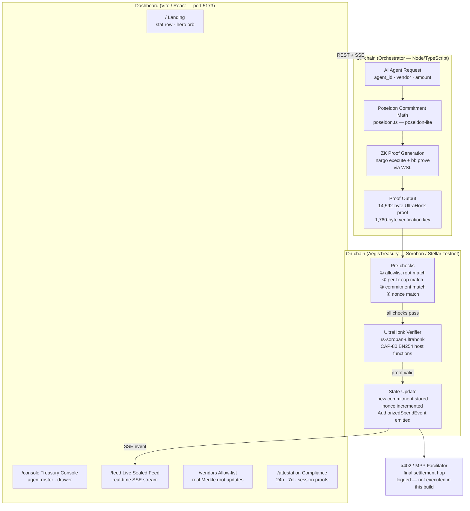
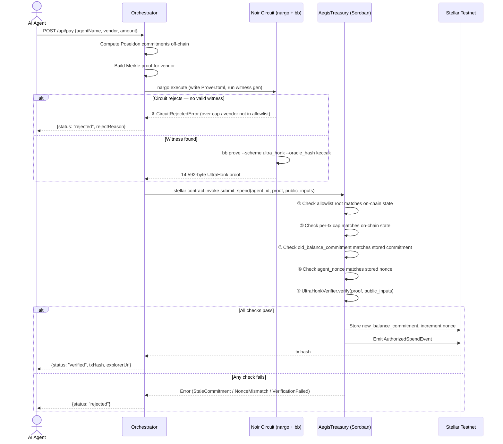
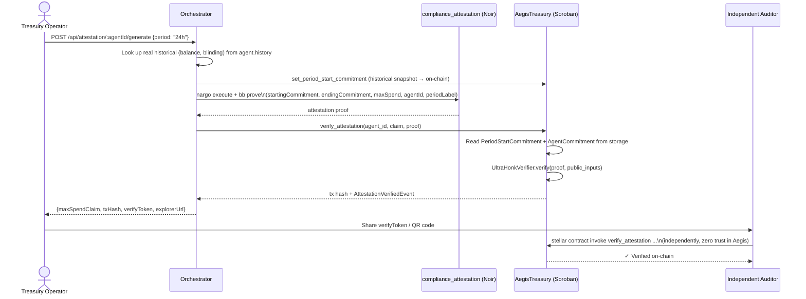

# Aegis

**Zero-knowledge spend compliance for AI agent payments on Stellar.**

> *Your agents pay in the open. What they spent, and why it was allowed, stays between you and the proof.*

[](https://noir-lang.org)
[](https://github.com/AztecProtocol/aztec-packages)
[-blue?style=flat-square)](https://stellar.org)
[](#test-results)

---

## The Problem

Stellar's **x402** and **MPP** protocols let AI agents autonomously pay for APIs, data, and compute — no human approving each transaction. That's live infrastructure.

But **Stellar is a public ledger**. Every payment your agent fleet makes — who it paid, how much, how often — is visible to anyone watching the chain. For a company running a fleet of agents:

- The public spend graph is a **competitive intelligence leak**
- Spending controls (caps, allow-lists) sit in a contract anyone can inspect but **no one can prove wasn't tampered with**

## The Solution

Aegis closes both gaps with **one ZK circuit**:

1. Each agent draws from a **shielded balance commitment** — not a visible running balance
2. Every payment is gated by a **real Noir/UltraHonk proof** that verifies policy compliance *before* the contract settles it
3. A **compliance attestation** lets an auditor verify aggregate spend facts (e.g. "under $X in 24 hours") without revealing any individual transaction

A non-compliant payment isn't rejected by an `if` statement — it **has no valid proof**, because the circuit's math can't be satisfied.

---

## Live Demo

| | |
|---|---|
| **Public Dashboard** | [aegis-delta-gules.vercel.app](https://aegis-delta-gules.vercel.app) |
| **Live Contract** | [`CDPFNN...6MF6`](https://stellar.expert/explorer/testnet/contract/CDPFNNPOXFZLFZOJRUN6PW7LYWOIU6SLFBJZKP3BUC6YMOUIL6XB6MF6) on Stellar Testnet |
| **Explorer** | Verify any tx at `stellar.expert/explorer/testnet/tx/<hash>` |

> The orchestrator deploys a **fresh** `AegisTreasury` instance every time it starts. The contract ID above is from the most recent run — every payment is independently verifiable on-chain.

---

## Architecture



---

## Payment Workflow



---

## Compliance Attestation Workflow



---

## Repository Layout

```
aegis/
├── aegis-circuit/              # Noir: spend_proof — per-payment ZK compliance proof
│   └── src/main.nr             #   6 constraints: commitment, balance, cap, Merkle membership
│
├── aegis-attestation-circuit/  # Noir: compliance_attestation — aggregate disclosure proof
│   └── src/main.nr             #   proves cumulative spend bounded without revealing individual txs
│
├── aegis-contract/             # Rust/Soroban: AegisTreasury on-chain verifier + policy state
│   ├── src/lib.rs              #   submit_spend, verify_attestation, policy management
│   ├── src/test.rs             #   15 unit tests (all pre-verification error paths)
│   └── tests/                  #   3 integration tests with real 14KB UltraHonk proofs
│
├── rs-soroban-ultrahonk/       # Vendored: UltraHonk verifier for Soroban (MIT, not written here)
├── poseidon_src/               # Vendored: Poseidon hash Noir library used by both circuits
│
├── orchestrator/               # Node/TypeScript: proof orchestration + REST/SSE API (port 4000)
│   └── src/
│       ├── server.ts           #   Express API — all endpoints
│       ├── treasury.ts         #   Core logic: agent state, payment flow, attestation
│       ├── prover.ts           #   Shells to WSL: nargo execute + bb prove
│       ├── chain.ts            #   Shells to WSL: stellar contract invoke
│       ├── poseidon.ts         #   Off-chain Poseidon math (verified bit-identical to circuit)
│       ├── roster.ts           #   5 agents, 8 vendors — single source of truth
│       ├── seed.ts             #   One-shot: register the demo roster on-chain
│       ├── demo-run.ts         #   One-shot: play the 12-payment scripted scenario
│       └── selftest.ts         #   14-check Poseidon/Merkle cross-verification
│
├── dashboard/                  # Vite/React: 5-screen frontend (port 5173)
│   └── src/
│       ├── LandingPage.tsx     #   Hero + stat row + "how it works"
│       ├── TreasuryConsole.tsx #   Agent roster + detail drawer
│       ├── LiveSealedFeed.tsx  #   Real-time SSE payment stream (amounts always sealed)
│       ├── VendorsScreen.tsx   #   Vendor allow-list + live Merkle root
│       └── AttestationScreen.tsx # Compliance attestation generator
│
├── deploy/                     # Shell scripts for manual contract inspection/deploy
├── docs/shadow.md              # Original hackathon PRD (pre-rename, "Umbra")
├── agent-hero-section/         # Design reference only — not deployed
├── DEMO_SCRIPT.md              # Full narration script for the demo video
└── PROJECT_REPORT.md           # Comprehensive end-to-end audit report
```

---

## What's Real vs. Out of Scope

### ✅ Real (verified, not mocked)

| Component | What's real |
|---|---|
| ZK Proofs | Real `nargo` 1.0.0-beta.9 + `bb` v0.87.0, real 14,592-byte UltraHonk proofs |
| On-chain Verification | `rs-soroban-ultrahonk` + Protocol 26 (CAP-80) BN254 host functions on Stellar Testnet |
| Payment Rejections | Every rejection is a genuine `nargo execute` constraint failure — no JS-side short-circuits |
| Vendor Allow-list | Depth-3 Poseidon Merkle tree; adding/removing a vendor rebuilds the tree and calls `update_policy` on-chain |
| Poseidon Parity | Off-chain `poseidon-lite` output is cross-verified bit-for-bit against the real circuit's output (14/14 self-test) |
| Transaction Hashes | Every hash in the dashboard links to a real Stellar Testnet transaction on stellar.expert |
| Replay Protection | A captured real proof resubmitted is rejected with `StaleCommitment` — tested in `tests/real_proof.rs` |
| Amount Privacy | The dashboard never renders a plaintext amount — amounts are sealed (`●●●●●●`) everywhere |

### 🚧 Explicitly Out of Scope (cryptographic boundaries, not shortcuts)

| Item | Why |
|---|---|
| **Live x402/MPP facilitator** | The final settlement hop to a vendor's real address must be publicly visible by construction — like a Tornado Cash-style pool, the withdrawal reveals an amount. Aegis hides *which* agent funded a payment, not the existence of a payment rail. That hop is **logged, not executed** in this build. |
| **CAP-79 muxed sub-accounts** | Agent identity is a plain `u64` — not a muxed `M...` Stellar sub-address. |

---

## Test Results

| Suite | Command | Result |
|---|---|---|
| `spend_proof` circuit | `cd aegis-circuit && nargo test` | ✅ **3/3 passing** |
| `compliance_attestation` circuit | `cd aegis-attestation-circuit && nargo test` | ✅ **3/3 passing** |
| `AegisTreasury` contract | `cd aegis-contract && cargo test` | ✅ **18/18 passing** (15 unit + 3 integration with real proofs) |
| Orchestrator Poseidon self-test | `cd orchestrator && npm run selftest` | ✅ **14/14 passing** |
| Dashboard Playwright e2e | `cd dashboard && npm run test:e2e` | ✅ **12/12 passing** |

> The integration tests (`tests/real_proof.rs`) load a real 14KB UltraHonk proof from fixtures, verify it on-chain, then replay the **same proof** and assert it's rejected — proving replay-attack protection against a real proof, not a dummy.

---

## Running Locally

> **Requires WSL (Ubuntu)** — the Noir/Barretenberg/Stellar toolchain doesn't ship native Windows binaries. The orchestrator calls `wsl.exe` automatically, so you stay in a normal Windows/PowerShell terminal day-to-day.

### Step 1 — Install toolchain inside WSL (one-time)

```bash
# Noir — pinned to 1.0.0-beta.9 (matches rs-soroban-ultrahonk's build target)
curl -L https://raw.githubusercontent.com/noir-lang/noirup/main/install | bash
~/.nargo/bin/noirup -v 1.0.0-beta.9

# Barretenberg — pinned to v0.87.0 (newer versions are incompatible)
mkdir -p ~/.bb087/bin
curl -L https://github.com/AztecProtocol/aztec-packages/releases/download/v0.87.0/barretenberg-amd64-linux.tar.gz -o /tmp/bb.tar.gz
tar -xzf /tmp/bb.tar.gz -C ~/.bb087/bin

# Stellar CLI v27.0.0
mkdir -p ~/.local/bin
curl -L https://github.com/stellar/stellar-cli/releases/download/v27.0.0/stellar-cli-27.0.0-x86_64-unknown-linux-gnu.tar.gz -o /tmp/stellar.tar.gz
tar -xzf /tmp/stellar.tar.gz -C ~/.local/bin

# jq (used by bb's bytes_and_fields output post-processing)
curl -sL https://github.com/jqlang/jq/releases/latest/download/jq-linux-amd64 -o ~/.local/bin/jq
chmod +x ~/.local/bin/jq ~/.local/bin/stellar

# Rust wasm target for building the Soroban contract
rustup target add wasm32v1-none
```

### Step 2 — Terminal 1: Start the Orchestrator

```bash
cd orchestrator
npm install
npm run start        # http://localhost:4000  (~1-3 min first run — deploys contract to Testnet)
```

> ⚠️ Use `npm run start`, **not** `npm run dev`. Dev mode redeploys the contract on every file save.

Poll until ready: `curl http://localhost:4000/api/status` → `"ready": true`

### Step 3 — Terminal 2: Seed & Run

```bash
cd orchestrator
npm run seed         # registers 5 agents + 8 vendors on-chain
npm run demo         # plays the 12-payment scripted scenario (real proofs + real txs)
npm run selftest     # cross-verifies Poseidon math off-chain == on-chain
```

### Step 4 — Terminal 3: Dashboard

```bash
cd dashboard
npm install
npm run dev          # http://localhost:5173
npm run test:e2e     # Playwright smoke test (needs orchestrator + dashboard both running)
```

### Optional: Run circuit & contract tests

```bash
cd aegis-circuit             && nargo test
cd aegis-attestation-circuit && nargo test
cd aegis-contract            && cargo test
```

---

## Why Stellar Protocol 26

Protocol 26 ("Yardstick", CAP-80) — which reached Testnet only weeks before this build — added **BN254 host functions** that make on-chain UltraHonk proof verification cheap enough to actually gate a payment.

Without CAP-80, verifying a 14KB pairing-based proof on Stellar would have been prohibitively expensive. Aegis is one of the first applications to wire UltraHonk verification into real agent payments using these new primitives.

---

## What We'd Build Next

- **Live x402/MPP facilitator** — wire the final settlement hop to a real payment rail
- **CAP-79 muxed sub-accounts** — per-agent `M...` Stellar addresses instead of plain `u64`
- **Per-agent transaction caps** — needs a small circuit extension to bind cap to `agent_id`
- **Parallel proof generation** — orchestrator currently serializes `nargo`/`bb` calls to avoid clobbering shared `target/` artifacts; batching is the main throughput bottleneck
- **Host the orchestrator** — containerize with the WSL toolchain baked in + `VITE_API_BASE` at build time so the public Vercel deployment is live for any visitor
- **Fuller e2e coverage** — Playwright suite that triggers real proof generation end-to-end, not just navigation and DOM assertions

---

## Credits

- [`rs-soroban-ultrahonk`](https://github.com/yugocabrio/rs-soroban-ultrahonk) — MIT-licensed UltraHonk verifier for Soroban, vendored under `rs-soroban-ultrahonk/`. Not written from scratch here.
- Noir Poseidon library — vendored under `poseidon_src/`
- Built for the **Stellar Hacks: Real-World ZK** DoraHacks hackathon (June 2026, ~3-day build window)
