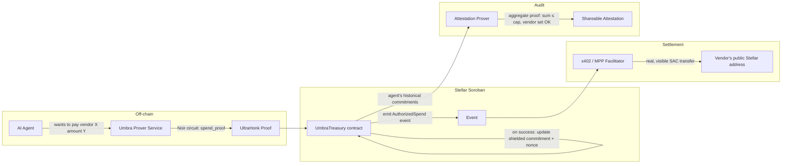

# shodow — Confidential, Provably-Compliant Treasury Rails for AI Agent Payments on Stellar

**PRD & Build Plan for Stellar Hacks: Real-World ZK**
**Author:** [you] · **Status:** Draft v1 · **Last updated:** June 26, 2026
**Submission deadline:** June 29, 2026, 12:00 PM PST — **you have ~3 days. Scope is written for that, not for a dream roadmap.**

> ⚠️ **On "100% probability."** No one can promise that — judging panels are human, and DoraHacks hackathons judge dozens of submissions on a rubric none of us has perfect visibility into. What I *can* do is build an idea and a PRD where every major design decision is traceable to something the Stellar Development Foundation (SDF) is actively saying, shipping, or asking for, *right now*, in their own words. That's the highest-leverage thing you control. Below, I show my work so you can see the reasoning, not just trust it.

> 📋 **Note on your "report":** You mentioned reviewing a report you'd made on ZK-Stellar activity, but no file came through with this conversation (I checked `/mnt/user-data/uploads` — empty). Rather than guess at its contents, I did fresh research directly against Stellar's blog, docs, GitHub orgs, and the DoraHacks hackathon page itself (citations inline below). If your report says something that contradicts this PRD, send it over and I'll reconcile — but everything here is sourced to primary material from the last few weeks, not training-data guesses.

---

## 0. The two questions you asked me to answer before proposing anything

You asked me to check two things before committing to an idea. Here's the honest answer to both, with evidence.

### "Is this going to feel relevant, or like it's going backward because it has no automation?"

**No — it's built around the most automation-forward thing happening on Stellar right now.** In March–April 2026, Stellar shipped **x402** and **MPP (Machine Payment Protocol)** — two competing-but-coexisting standards that let AI agents autonomously discover, authorize, and settle stablecoin payments with zero human in the loop, for API calls, data feeds, and compute. SDF's own blog frames this as *"software paying for software, automatically, without a human in the loop,"* and both protocols are now live on Stellar mainnet, with MPP alone launching with 100+ integrated services including Anthropic, OpenAI, Stripe, and Visa. This is the single newest, most aggressively-marketed pillar of Stellar's current narrative — it is not a legacy feature you'd be reviving, it's a six-week-old mainnet launch.

The idea below is a privacy + compliance layer sitting **directly on top of** x402/MPP agent payments. It doesn't replace automation with something manual — it makes the *existing* automation safe enough for an enterprise treasury team to actually turn on.

### "Does this use their hard-built tech in a way that would make them feel good — not just bolted on?"

**Yes, and specifically the newest, least-used parts of it.** Three things converge here that almost no hackathon team will have touched yet, because they're all extremely recent:

1. **Protocol 26 "Yardstick" (CAP-80)** went live on mainnet **May 6, 2026** — seven weeks ago. It added 9 new BN254 host functions specifically so that **Noir/UltraHonk proof verification becomes "significantly cheaper" on-chain**, building on Protocol 25 "X-Ray"'s native Poseidon/Poseidon2 hashing. SDF's own upgrade post calls "cheaper ZK operations" one of the changes that "compound" even though they "don't make headlines." This hackathon exists *because* that primitive just landed — using it for something real is literally what the brief is asking for.
2. **x402 + MPP on Stellar are six weeks old**, and SDF's own published architecture explicitly calls out that the *spending controls* (caps, multisig, scoped permissions via OpenZeppelin smart accounts) are public-ledger features — Stellar is, by their own description, *"open by design"* with privacy *"opt-in and configurable at the application layer."* That's a stated gap, not an assumption.
3. **SDF is already on record wanting exactly this combination.** Their privacy strategy post says they're *"exploring administrative tools such as viewing keys for selective disclosures that can help institutions address illicit finance obligations,"* and they partnered with Nethermind on a working privacy-pool implementation (`stellar-private-payments`) that already includes an **Association Set Provider (ASP)** — a compliance primitive using Merkle membership/non-membership proofs to prove a payment is or isn't tied to an approved/blocked set, *without breaking privacy*. And tellingly, the **official `stellar/stellar-dev-skill` AI-coding-skill repo ships an `agentic-payments.md` skill and a `zk-proofs.md` skill side-by-side** in the same package — SDF's own tooling is already structured around the idea that these two things belong together. Nobody has shipped the thing that connects them for agent payments specifically yet.

So: not a "go back to basics" demo, and not ZK bolted onto an unrelated app. It's the newest crypto primitive (BN254/Poseidon on Soroban) wired into the newest payment primitive (x402/MPP), solving a gap SDF has already named in public.

---

## 1. The problem, stated plainly

An enterprise wants to run a fleet of AI agents that autonomously pay for APIs, data, and compute via x402/MPP on Stellar. Two things are true at once:

- **Stellar is a public ledger.** Every payment an agent makes — who it paid, how much, how often — is visible to anyone who looks. For a company running dozens of agents with department budgets, vendor relationships, and pricing strategy embedded in that spend pattern, that's a competitive-intelligence leak, not a minor inconvenience.
- **Spending limits today are enforced, but not *proven*.** OpenZeppelin smart account policies (caps, multisig, scoped permissions) are real and live, but they're rules sitting in a public contract — anyone auditing the books has to trust the contract was configured right and never tampered with. There's no portable, cryptographic *receipt* that says "every payment this agent made in Q2 obeyed policy" that a CFO, auditor, or regulator can verify in isolation, without being handed the whole ledger.

**Umbra closes both gaps using one circuit:** agents draw from a shielded internal budget commitment instead of a visible running balance, every spend is gated by a ZK proof that checks the spend against policy (per-tx cap, vendor allow-list, remaining budget) *before* it's allowed to settle, and at any time a human can generate a separate, small ZK proof that discloses an aggregate compliance fact ("total Q2 spend ≤ $X, zero non-allow-listed vendors") without disclosing the underlying transaction graph.

This is the same shape as Nethermind's own SPP privacy-pool design (private internal movement, visible-but-unlinkable final settlement, ASP-style compliance proofs) — just retargeted from "private human payments" to "private *autonomous agent* payments," which is the part of the ecosystem that's actually growing right now.

---

## 2. What it's called and the one-line pitch

**Umbra** *(Latin: shadow)* — **"Your agents pay in the open. What they spent, and why it was allowed, stays between you and the proof."**

Sub-line for the README/demo: *A confidential spending layer for AI agent payments on Stellar — every payment is policy-checked by a zero-knowledge proof before it settles, and compliance can be proven on demand without exposing the ledger.*

---

## 3. The two "wow" moments — design these first, build everything else to serve them

You asked specifically for UX that makes judges feel something, not just a technically-correct backend. These two moments are the actual product; everything in Section 6 exists to make them land in under 90 seconds of screen time.

### Wow moment #1 — "Watch them spend, prove they followed the rules, see nothing else"

A live feed of agent payments streams in, machine-speed (one every 2–4 seconds, matching x402's real settlement latency). Each card *arrives sealed* — amount and counterparty rendered as `●●●●●●` — then, ~1 second later, the card's left edge flashes a thin green bar and a small `✓ Policy proof verified on-chain` tag fades in, with a tiny on-chain tx link. The visual story, with zero narration needed: **payments are happening, they are hidden, and they are simultaneously, verifiably, not breaking any rule.** That tension — opaque *and* trustworthy — is the entire thesis of the project, delivered visually in one continuous feed.

### Wow moment #2 — "Prove the quarter without opening the books"

A single button: **"Generate Compliance Attestation."** Click it, a ~2 second spinner (this is real proving time, not fake — and it's fast specifically *because* of the new Yardstick host functions, which is worth saying out loud in the demo), and out comes a shareable, independently-verifiable artifact: a QR code / link that says, e.g., *"Agent fleet 'research-team', Q2 2026: total spend ≤ $12,000. 0 payments to non-allow-listed vendors. Verified ✓."* Anyone — a judge, an auditor, a regulator — can open that link and re-verify the proof themselves, with no access to Umbra's dashboard or database. This is the moment that maps directly onto SDF's own stated institutional roadmap ("viewing keys for selective disclosure... illicit finance obligations") — say that explicitly in the demo narration.

---

## 4. Judging-criteria self-check

DoraHacks hackathons in this Stellar series (confirmed pattern from the sibling "Stellar Hacks: Blend" hackathon's published rubric — **verify against this specific hackathon's "Judging Criteria" tab before you submit**, in case it differs) score against: *Code quality · Technical complexity · Innovative use case · Working prototype · Feature completeness · Documentation quality · Interface design · User flow · Accessibility · Problem-solution fit · Market viability · Demo quality · Documentation.*

| Criterion | How Umbra hits it |
|---|---|
| Technical complexity | Real Noir circuit (Poseidon commitments + Merkle compliance proof + range checks), real Soroban verifier, genuinely uses brand-new CAP-80 host functions |
| Innovative use case | First (as far as current public repos show) ZK privacy/compliance layer purpose-built for x402/MPP agent payments specifically, not generic private transfers |
| Problem-solution fit | Directly answers a gap SDF has named in its own blog (public ledger + spending controls = no confidentiality), not an invented problem |
| Market viability | Treasury/compliance teams adopting agent payments at any scale need exactly this before they'll turn on autonomous spend in production |
| Interface design / User flow | Two designed "wow" moments (Section 3), not a raw contract-call UI — see full spec in Section 6 |
| Demo quality | 2–3 min video has a built-in narrative arc: problem → sealed feed → proof verifies → attestation generated → "an auditor can check this without us" |
| Documentation | README explicitly states what's real vs. mocked per the hackathon's own stated preference for "honest work-in-progress" over "polished mystery" |

---

## 5. Scope: what gets built in ~3 days, what's a stretch, what's explicitly out

Be ruthless here. A working, narrow, *honest* demo beats a half-finished ambitious one — the hackathon's own submission guidance says this explicitly: *"if something's unfinished or you used mock data in places, just say so... we'd rather see an honest work-in-progress than a polished mystery."* Use that line in your README. It's your permission slip.

### MVP — must ship
1. One Noir circuit (`spend_proof`) implementing the constraints in Section 7.2 — Poseidon-committed agent balance, per-tx cap check, vendor-allowlist Merkle membership.
2. One Soroban contract (`UmbraTreasury`) that verifies the UltraHonk proof and updates on-chain state (built on top of, not from scratch versus, the existing `rs-soroban-ultrahonk` verifier).
3. A CLI or minimal script that simulates 1 admin + 2–3 agents making payments, some compliant, **one deliberately non-compliant** (over cap, or to a non-allow-listed vendor) so the demo can show a proof *failing to verify* — this is more convincing to judges than only showing happy paths.
4. The dashboard: Treasury Console (set budgets/policy) + Live Sealed Feed (Wow #1). This is the part that actually needs to look good — spend your UI hours here, not on the circuit's edge cases.
5. README stating plainly what's real (circuit, contract, proof verification) vs. simulated (the x402 facilitator leg — see below).
6. 2–3 min demo video per Section 9.

### Stretch — only if MVP is done with time to spare
1. Wow #2, the Compliance Attestation button (a second, smaller Noir circuit reusing the same commitment scheme — see Section 7.3). This is high-impact but is genuinely separable from the MVP story, so don't let it block submission.
2. Real, live x402 settlement leg (calling the actual Built-on-Stellar x402 facilitator / OpenZeppelin Relayer) instead of a mocked "payment authorized → would settle via x402 here" event. Wire this only after the proof-verification path is rock solid, since it's the most likely thing to eat a full day on auth/relayer setup.
3. Per-agent identity via **muxed accounts (CAP-79)** — each agent as an `M...` sub-address under one funded treasury `G...` account, so you don't need to fund/trust-line each agent separately (also leans on CAP-73's auto-trustline SAC behavior). Tasteful, very fresh (shipped May 6), and cheap to add if Day 2 goes well — but cut without hesitation if it threatens the demo.

### Explicitly out of scope — say so in the README, don't apologize for it
- Hiding the *final settlement amount* paid to an external vendor. This is a real cryptographic limit, not a shortcut: the vendor's x402 facilitator must see a real, verifiable payment to release the resource, so the **last hop is necessarily public** — exactly like Tornado-Cash-style privacy pools, where deposits/internal transfers are private but a withdrawal to an external address reveals an amount. What Umbra hides is *which agent's shielded budget funded it, the agent's running balance, and the link between successive payments by the same agent* — not the existence of the payment itself. **Say this explicitly in your README and demo.** Stating the real cryptographic boundary, instead of overclaiming "fully private payments," will read as far more credible to any judge who actually knows ZK — and several of them will.
- Multi-asset support, mainnet deployment, real KYC/sanctions-list integration (use a toy allow-list of 4–5 dummy vendor IDs), production security audit.
- A full UTXO/multi-note model à la Nethermind's SPP. Use a single running shielded-balance-commitment per agent instead (an "account model," not a "note model") — far fewer moving parts, still genuinely private, still genuinely a real ZK circuit, and a defensible simplification to explain on camera if asked.

---

## 6. UX / UI Specification

Design language: borrow Stellar's own visual register — dark, high-contrast, lots of negative space, monospace for addresses/hashes, a single accent color reserved *only* for the "verified" state so it reads as meaningful rather than decorative. Think "mission control for money," not "generic crypto dashboard."

### Screen 1 — Treasury Console (setup, ~30 sec of demo time)
- A simple form, no code shown: "Create Agent" → name, starting shielded budget, per-transaction cap.
- A visual policy builder: a chip-style multi-select of vendor categories/IDs that feeds the Merkle allow-list root — dragging a vendor in/out regenerates the root live, with a small "root updated" pulse.
- A horizontal bar per agent showing *allocated* budget — deliberately **not** showing live remaining balance here (that's the point: even the operator's home screen treats spend as shielded by default; remaining balance only appears inside that agent's detail view, gated the same way an auditor would see it).

### Screen 2 — Live Sealed Feed (Wow #1, the centerpiece — ~45 sec of demo time)
- A vertically scrolling feed, newest on top, styled like a trading-terminal tape crossed with a chat log.
- Each event: `Agent: research-bot-2  →  ●●●●●●  |  ⏳ verifying...` then transitions to `✓ Policy proof verified · view tx`.
- One event in the simulated run should **fail**: render it visibly differently (red, "✗ Proof rejected — over per-tx cap") so judges see the system actually enforces something rather than rubber-stamping everything. This single failing case is worth more credibility than ten passing ones.
- A small running counter at the top: "47 payments settled · 0 policy violations reached settlement" — the number that matters to a CFO, with no underlying detail leaked.

### Screen 3 — Compliance Attestation (Wow #2, stretch — ~20 sec of demo time)
- One button. One spinner labeled honestly ("Generating zero-knowledge proof..." not "AI is thinking..."). One output: a card with the attested statement in plain English, a QR code, and a "Verify independently →" link that opens a bare, dashboard-free verification page — proving the point that you don't need to trust Umbra's UI, only the proof.

### Interaction principle running through all three screens
Nothing on screen should ever show a number derived from data the system is supposed to be hiding, *except* inside an explicit "you are now looking at private data because you hold the key" context (agent owner's own detail view, or a freshly-generated attestation). If a judge can screen-record your demo and a stranger watching the recording can reconstruct the hidden ledger, the UX has failed at the one thing it exists to prove.

---

## 7. System Architecture



### 7.1 Why each Stellar primitive is in here, specifically
- **Noir + UltraHonk**, not Circom: the hackathon brief itself flags Noir as the toolchain CAP-80 was built to make cheaper to verify on-chain. Using Circom/Groth16 here would be technically valid but misses the point of *this specific* protocol upgrade.
- **`rs-soroban-ultrahonk` verifier** (from the hackathon's own resources list) as the base for `UmbraTreasury` — don't write a verifier from scratch; fork and extend it with the policy state (balance commitments, allow-list root, nonces). This is the "less complex technology, more leverage" move you asked for.
- **Poseidon/Poseidon2** (native since Protocol 25 "X-Ray") for every hash inside the circuit — commitments and Merkle tree nodes — because it's the hash these new host functions were built to make cheap, and because it keeps the circuit small enough to actually finish in 3 days.
- **x402/MPP** as the settlement rail the proof gates — Umbra is explicitly a layer *on top of* the live agent-payment protocols, not a competing payment rail. This matters for the pitch: you're not asking judges to imagine a new payments system, you're securing one that already exists and is already growing.
- **(Stretch) Muxed accounts, CAP-79** — per-agent sub-identity under one funded treasury account, the newest identity primitive on the network.

### 7.2 The core circuit — `spend_proof`

**Public inputs:**
- `old_balance_commitment` (Poseidon hash, read from on-chain contract state)
- `new_balance_commitment` (Poseidon hash, written to on-chain contract state on success)
- `per_tx_cap` (a policy parameter the contract enforces, set by the treasury admin)
- `vendor_allowlist_root` (Merkle root, admin-updatable)
- `agent_nonce` (replay protection — must match the on-chain stored nonce, incremented on success)

**Private inputs:**
- `old_balance`, `blinding_old`
- `amount`
- `new_balance` (= `old_balance − amount`), `blinding_new`
- `vendor_leaf`, `merkle_path` (proves the vendor is in the allow-list)

**Constraints:**
1. `Poseidon(old_balance, blinding_old, agent_id) == old_balance_commitment` — proves you know the real current shielded balance, not a made-up one.
2. `new_balance == old_balance − amount` and `new_balance ≥ 0` — no overspend, no negative balances.
3. `amount ≤ per_tx_cap` — the actual policy check.
4. `Poseidon(new_balance, blinding_new, agent_id) == new_balance_commitment` — binds the new commitment correctly so the contract can update state.
5. Merkle path verifies `vendor_leaf` under `vendor_allowlist_root` — the vendor is approved, without revealing *which* vendor to anyone who doesn't already know the leaf.

This is intentionally close in shape to Nethermind's own SPP transfer circuit (commitment in, commitment out, Merkle membership for compliance) — minus the multi-note UTXO bookkeeping, which you don't have time for and don't need to make the point.

### 7.3 The attestation circuit (stretch) — `compliance_attestation`
Same commitment scheme, different statement: given a sequence of historical `(old_balance_commitment, new_balance_commitment)` pairs for an agent over a period, prove that cumulative spend (`sum of amounts`) is `≤ X` and that every `vendor_leaf` used was in the (possibly time-versioned) allow-list, without revealing individual amounts or vendors. If time is tight, a simplified version that just proves "final balance ≥ starting balance − X" is a legitimate, honest fallback — say so on camera if you use it.

### 7.4 Contract surface (`UmbraTreasury`, Soroban/Rust)
```
init(admin: Address, vendor_allowlist_root: BytesN<32>)
register_agent(agent_id: u64, initial_commitment: BytesN<32>) -> requires admin
update_policy(per_tx_cap: i128, new_allowlist_root: BytesN<32>) -> requires admin
submit_spend(agent_id: u64, proof: Bytes, public_inputs: SpendPublicInputs) -> bool
    // verifies proof via the UltraHonk verifier (CAP-80-accelerated)
    // on success: stores new commitment + nonce, emits AuthorizedSpend event
get_attestation_root(agent_id: u64) -> BytesN<32>  // for the stretch feature
```

---

## 8. Tech stack & exact resources to pull from (don't build these from zero)

| Layer | Use this | Link |
|---|---|---|
| Circuit language | Noir | https://noir-lang.org/docs/ |
| On-chain verifier base | `rs-soroban-ultrahonk` | https://github.com/yugocabrio/rs-soroban-ultrahonk |
| Privacy-pool design reference | Nethermind `stellar-private-payments` (commitment/nullifier/ASP pattern) | https://github.com/NethermindEth/stellar-private-payments |
| ZK host functions reference | Stellar Docs — ZK Proofs on Stellar | https://developers.stellar.org/docs/build/apps/zk |
| Agent payments | x402 on Stellar docs | https://developers.stellar.org/docs/build/agentic-payments/x402 |
| Agent payments background | SDF blog — "x402 on Stellar" | https://stellar.org/blog/foundation-news/x402-on-stellar |
| Protocol context (cite in README/pitch) | Yardstick (Protocol 26) announcement | https://stellar.org/blog/foundation-news/yardstick-stellar-protocol-26 |
| Privacy roadmap (cite for the "viewing keys" framing) | SDF — "Strategy for Privacy on Blockchain" | https://stellar.org/blog/ecosystem/strategy-for-privacy-on-blockchain |
| AI coding assistance, Stellar-specific | `stellar/stellar-dev-skill` — install the `zk-proofs` and `agentic-payments` sub-skills | https://github.com/stellar/stellar-dev-skill |
| End-to-end Noir tutorial | James Bachini — Noir on Stellar | https://jamesbachini.com/noir-on-stellar/ |
| Smart account spending limits | OpenZeppelin Relayer / smart account docs (linked from x402 page above) | see x402 docs |
| Frontend scaffolding | Soroban examples repo (for wiring patterns, not the groth16 verifier itself) | https://github.com/stellar/soroban-examples |

**How to actually use these docs under time pressure:** install the `stellar/stellar-dev-skill` repo into whatever AI coding agent you're using (`npx skills add https://github.com/stellar/stellar-dev-skill`, or as a Claude Code plugin) *before* you start — it gives your coding assistant grounded, current knowledge of Soroban patterns, the x402/MPP flow, and BN254/Poseidon usage, instead of pattern-matching on stale training data. Then fork `rs-soroban-ultrahonk` rather than writing a verifier integration from scratch — your actual new code should be the policy logic (commitments, nonces, allow-list root) wrapped around their verifier call, not the pairing math.

---

## 9. Day-by-day build plan (today is June 26; deadline is June 29, 12:00 PM PST)

**Today (June 26, remainder of day) — circuit first, nothing else.**
Write `spend_proof` in Noir. Get it compiling and generating a proof locally for one hardcoded case, both a passing and a deliberately failing one (over-cap). Do not touch the contract or frontend yet. If the circuit isn't proving correctly by the time you sleep, everything downstream is at risk — protect this.

**June 27 — contract integration.**
Fork `rs-soroban-ultrahonk`, wire in `UmbraTreasury`'s state (commitments, nonces, allow-list root), deploy to Testnet, verify your Day-1 proof on-chain end to end. Stop here and confirm a real proof verifies on real Testnet before writing a single line of frontend.

**June 28 — simulate the agents, build the dashboard.**
Morning: a small script that plays 2–3 agents through 10–15 payments against the deployed contract (mostly compliant, a couple deliberately not). Afternoon/evening: build Screen 1 and Screen 2 (Section 6) against the real event stream from that simulation. If you have hours left at the end of the day and everything above is solid, start the attestation stretch (Section 7.3) — otherwise, don't.

**June 29, morning (deadline noon PST) — record, write, submit.**
Record the 2–3 min demo (script in Section 10) early — leave at least 90 minutes of buffer before the deadline for upload/submission friction. Finish the README (Section 11) in parallel if you have a second person; if solo, README before video, since a clear README with no video is recoverable, a great video with no working repo is not.

---

## 10. Demo video script outline (2–3 minutes)

1. **(0:00–0:25) The problem, in one breath.** "Stellar's x402 and MPP just made it possible for AI agents to autonomously pay for anything — APIs, data, compute — with no human approving each transaction. That's live on mainnet right now. But every one of those payments is on a public ledger. If you're a company running agent fleets, your competitors can read your spend graph in real time. Umbra fixes that without touching the settlement rail."
2. **(0:25–1:10) Wow #1 live.** Show the Treasury Console for 5 seconds (set a budget, set a vendor allow-list), then cut to the Live Sealed Feed running for real, narrating exactly one passing event and the one failing event. "That payment just got rejected — it would have exceeded this agent's per-transaction cap, and the proof simply doesn't verify. No one had to catch that by reading a log."
3. **(1:10–1:50) Why it's real ZK, fast.** 15–20 seconds on the circuit (show the Noir file briefly, name the constraints in plain English), then explicitly: "This verifies cheaply on-chain because of host functions Stellar shipped seven weeks ago in Protocol 26 — this is genuinely new infrastructure, not a workaround."
4. **(1:50–2:30) Wow #2, if built.** The attestation button, the QR code, the independent verification link. "An auditor doesn't need access to our dashboard, our database, or our trust. Just this."
5. **(2:30–2:45 or end) What's mocked, said out loud.** "The final settlement to the vendor goes through Stellar's live x402 facilitator — in this build we [simulate / fully integrate] that last hop; everything before it — the proof, the verifier, the policy logic — is real and on Testnet right now." Then a one-line close: "Your agents pay in the open. What they spent, and why it was allowed, stays between you and the proof."

---

## 11. README structure (matches submission requirements exactly)

```
# Umbra
[one-line pitch from Section 2]

## What this is
[Section 1 + 2, condensed to ~150 words]

## What's real vs. simulated  ← do not skip this section
- Real: Noir circuit, on-chain UltraHonk verification via CAP-80 host functions,
  policy enforcement, the failing-proof case
- Simulated/mocked: [be specific — e.g. "the x402 facilitator call is logged but
  not executed against a live facilitator in this build"]

## Architecture
[paste the mermaid diagram + 1-2 paragraphs from Section 7]

## Why this uses Stellar's ZK primitives specifically
[2-3 sentences: Protocol 25/26 host functions, why Noir, why now]

## Demo video
[link]

## Running it locally / on Testnet
[exact commands]

## What we'd build next
[the stretch items you didn't reach + the out-of-scope items from Section 5,
framed as roadmap, not failure]
```

---

## 12. Risks and how to defuse them on camera

- **"This isn't fully private, the final payment is visible."** Pre-empt it — Section 5's "explicitly out of scope" framing is your answer, and it's a sign of cryptographic literacy, not a weakness, if you say it first instead of waiting to be asked.
- **"Why not just use the existing Nethermind SPP?"** Because SPP is a general private-payments pool for human-initiated transfers; Umbra is purpose-built for the agent-payment policy problem (per-tx caps, vendor allow-lists, machine-speed proof generation, attestation-on-demand) — a different circuit, a different UX, a different user (a treasury ops person managing agents, not an individual sending a private payment).
- **Running out of time on Wow #2.** It's explicitly a stretch goal in this PRD for exactly this reason — cut it without guilt if Day 3 morning arrives and it's not solid. Wow #1 alone, done well, with one honest failing case in the feed, is a complete and compelling submission.

---

*End of PRD. Build the circuit first.*
